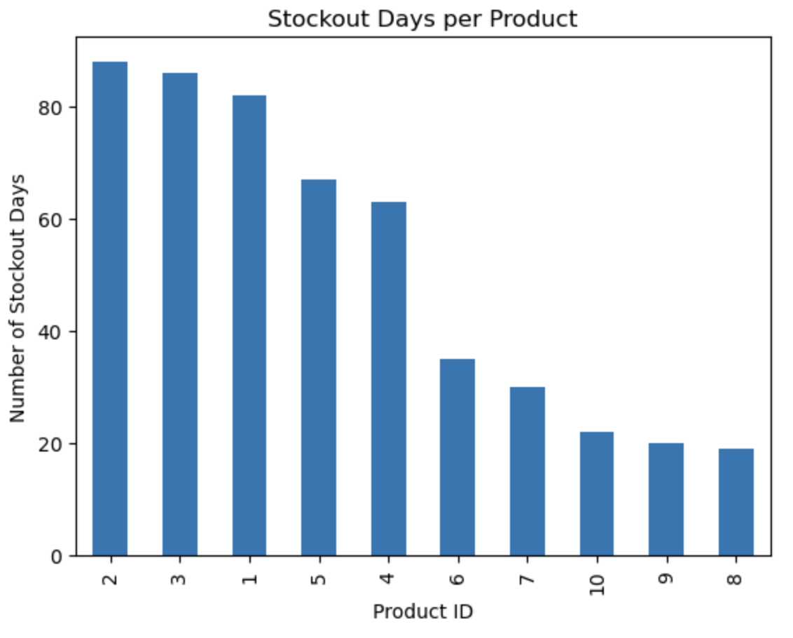
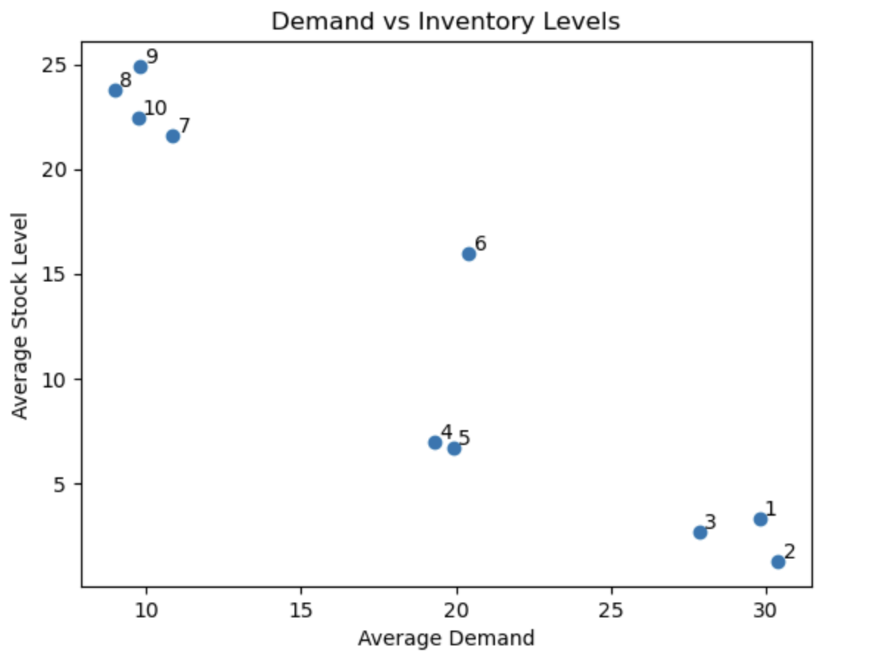

Data-Driven Inventory Optimization Using SQL and Python

> Identified understocked high-demand products and overstocked low-demand items, and proposed reorder point optimizations to reduce stockouts and excess inventory.

## Overview

This project analyzes inventory data to identify inefficiencies in stock management, including frequent stockouts and overstocking. Using SQL and Python, the analysis uncovers demand patterns and proposes data-driven reorder point strategies to improve inventory performance.

---

## Objectives

* Identify products experiencing frequent stockouts
* Detect overstocked items with low demand
* Analyze demand variability across products
* Develop reorder point recommendations using statistical methods

---

## Tools & Technologies

* **Python** (Pandas, NumPy, Matplotlib)
* **SQL (MySQL)**

---

## Dataset

A synthetic dataset was generated to simulate real-world warehouse operations, including:

* `product_id` – unique identifier
* `date` – daily observation
* `demand` – units sold per day
* `stock_level` – end-of-day inventory
* `lead_time` – restocking delay (days)
* `holding_cost` – cost per unit per day

The dataset includes multiple demand profiles (high, medium, low) to reflect realistic inventory scenarios.

---

## Key Analysis

### 1. Stockout Analysis (SQL)

Identified products with the highest number of stockout days:

```sql
SELECT product_id, COUNT(*) AS stockout_days
FROM inventory
WHERE stock_level = 0
GROUP BY product_id
ORDER BY stockout_days DESC;
```

---

### 2. Demand vs Inventory (Python)

Compared average demand and inventory levels to detect inefficiencies.

* High demand + low stock → understocked
* Low demand + high stock → overstocked

---

### 3. Reorder Point Calculation

Reorder points were estimated using:

**Reorder Point Formula:**

ROP = d × L + SS

Where:

* (d) = average demand
* (L) = lead time
* (SS) = safety stock (based on demand variability)

---

## Key Findings

* Product 2 experienced high demand and frequent stockouts, indicating that current reorder policies are insufficient to meet demand
* Product 8 maintained high inventory despite low demand, suggesting inefficient use of inventory capital and excess holding costs
* Inventory distribution across products was misaligned with demand patterns, leading to both lost sales and operational inefficiencies
* Product 6 stockouts decreased by approximately 32% (from 62 to 42 instances) after inventory adjustments, highlighting that targeted, product-level strategies can significantly outperform uniform inventory increases
* Reduced simulated stockouts by approximately 12% after adjusting inventory levels, highlighting that simple inventory increases alone are insufficient and that more targeted, demand-aligned allocation strategies are required

---

## Business Impact

This analysis demonstrates how data-driven inventory policies can:

* Reduce stockouts and prevent lost sales for high-demand products  
* Lower holding costs by minimizing excess inventory  
* Improve inventory allocation by aligning stock levels with demand patterns  

---

## Recommendations

* Increase reorder points and safety stock for high-demand products
* Reduce inventory levels for low-demand items
* Implement demand-driven inventory policies rather than static thresholds
* Results indicate that reallocating inventory across products may be more effective than uniformly increasing stock levels

---

## Visualizations

### Stockout Analysis


### Demand vs Inventory


---

## Project Structure

```
inventory-analysis/
│
├── data/
│   └── inventory_data.csv
│
├── sql/
│   └── analysis_queries.sql
│
├── notebooks/
│   └── inventory_analysis.ipynb
│
└── README.md
```

---

## Future Improvements

* Simulate optimized reorder policies and compare performance
* Incorporate service level targets for safety stock calculation
* Build an interactive dashboard (Tableau / Power BI)

---

## Author

Byron Moreira

B.Sc. in Computer Applications, Mathematics & Statistics
